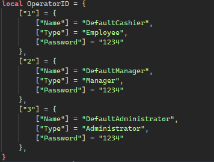

# Installation

:::info

Download the recent available file for this product via [Axon](https://axon.whitehill.group).

:::

### 1) Enable HTTP Requests {#1}
<iframe width="705.61" height="397.5" src="https://www.youtube.com/embed/qtKN_3Moi7M" title="Enabling HTTP Requests" frameborder="0" allow="accelerometer; autoplay; clipboard-write; encrypted-media; gyroscope; picture-in-picture; web-share; fullscreen"></iframe>

### 2) Product Insertion {#2}
Insert your file by 'dragging' the product file into Roblox Studio with your game fully loaded. The deactivation field has been purposely left unobfuscated to show you an example of disabling tags, you could place this in one-way systems to reduce the amount of activations by trolling customers.

Your game will need to be published for the product to work.

### 3) Monitoring Station & Operator Barcodes {#3}
The monitoring station is used to keep track of activation events. It also comes with an integration for [VoCoVo](https://discord.com/invite/3DR632F) and [Walvo](https://discord.com/invite/kybo)

Setting up Integrations is simple with the 'AutomaticIntegrations' setting, with this setting you can choose if you want to use the Applegate VoCoVo or the Kybo Walvo. Setting the value next to it to true will enable it.

:::tip

Want to use the same accounts as SCO V3? Set the 'SCOv3Location' to your SCOv3 folder.

:::

Make sure the 'OperatorID' in the Settings.Account module are the same as the one in your JSM | Operator Barcode.

### 4) Gate Configuration {#4}
If you're planning to use more than one set of anti-theft gates for your store, you will need to setup 'zones'. This needs to be done for the gate & sensor.

1. In explorer, click the 'Sensor' for your desired gate
2. Change the `Zone` to a unique numerical value that isn't used by any other gate
3. Repeat this for both of your anti-theft gates, using the same numerical value as your sensor
:::tip

You can have an unlimited number of sensor and anti-theft gates for your game, just adjust the `Zone` in each model to link them together.

:::

:::warning

This step is very important to prevent activations all over your store. If a sensor/gate isn't working, double check that you [set the zones correctly](#4).

:::

### 5) Creation of Items {#5}

We recommend the use of our Whitehill Configurator Tool which can be downloaded [here](https://create.roblox.com/store/asset/96844493449121/Whitehill-Tool-Configurator)

The **Test Tag** can be used to test your gates, it can also show you how to 'protect' your product to raise an alarm from the anti-theft gates.

1. Click onto your desired tool in explorer
2. **Inside** the Tool, click the plus & search for `BindableFunction`
3. Change the name of the `BindableFunction` to `JSM | EAS Test Tag`
4. Add a 'booleen' attribute into the 'JSM | EAS Test Tag', it should be called 'EASActive'
5. Enable the 'EASActive' value to 'arm' the tag for future activations.

Products like SCO v3 will search for the 'JSM | Item Data' object and disable the EASActive value.
