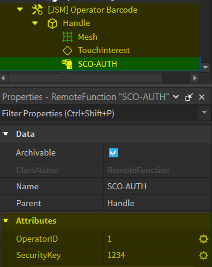

import Tabs from '@theme/Tabs';
import TabItem from '@theme/TabItem';

# Installation

:::info

Download the recent available file for this product via [Axon](https://axon.whitehill.group). If you were using SCO v2 before SCO v3, it is important to note that the setup process has changed massively. If you're updating to SCO v3.1, you will need to reconfigure your items and operator barcodes.

:::

:::note

The base file only includes the JSM SelfServ 7350. All other models and accessories are available on Axon, in the dropdown next to the Download button.

:::

:::tip

Trying to update your existing install? Check out our [Update Guide](/jsm/sco-v3/updating) instead.

:::

### 1) Enable HTTP Requests {#1}
In Roblox Studio with your selected game open, click the 'Home' tab, then 'Game Settings'. Move to the 'Security' tab in the open window and make sure the slider for 'Allow HTTP Requests' is enabled and then hit 'Save'.

<iframe width="705.61" height="397.5" src="https://www.youtube.com/embed/qtKN_3Moi7M" title="Enabling HTTP Requests" frameborder="0" allow="accelerometer; autoplay; clipboard-write; encrypted-media; gyroscope; picture-in-picture; web-share; fullscreen"></iframe>

### 2) Product Insertion {#2}
Insert your file by 'dragging' the product file into Roblox Studio with your game fully loaded. The model is already ungrouped upon inserting so there is no need to ungroup.

Your game will need to be published for the product to work.

### 3) Folder and File Movement {#3}
You no longer need to move folders or files into ServerStorage, as the tills now automatically load everything in.

### 4) Whole System Configuration {#4}
Inside the `JSM | SelfCheckout V3` folder, you will find the `SystemConfig` script. Double-click it to be shown the different options that can be customised. This step will contain some features to elaborate, although the rest is annotated or self-explanatory.

<Tabs>
<TabItem value="uitheme" label="UITheme" default>

- If you set this to 'Custom', it will load your own theme from **ServerStorage**.
- If you set this to 'Default', it will load the commonly used JSM UI.
- We offer some additional themes created by other creators, check out the **Themes** page for information.

</TabItem>
<TabItem value="maintenance" label="Maintenance">

- It is important to note that not all self-checkouts support this feature.
- Some checkouts, not all, are presented with an 'on/off' button.

</TabItem>
<TabItem value="ingamestaff" label="InGameStaff">

- This feature is used to disable interventions, e.g, help call, when a staff member is not present in-game to keep checkouts running
- You can control the `StaffThreshold` to set the bare minimum of staff required before disabling interventions

</TabItem>
</Tabs>

### 5) Operator Barcodes & Pins {#5}
Inside the `JSM | SelfCheckout V3` folder, you will find the `Accounts` settings script under `Deploy`. You can manage the access level, operator ID and pins through this script.

- `Employee` - able to handle basic interventions, e.g, age approval
- `Manager` - ability to close & open checkouts
- `Administrator` - ability to access the system functions section

The ID in each account must be **unique**. To setup the actual operator barcode, click and open the tool. You'll find a function called "JSM | Operator Barcode". Within this function there is one attribute, "AccountID". Set this to the account id you previously made in the Accounts script.

We recommend the use of our Whitehill Configurator Tool which can be downloaded [here](https://create.roblox.com/store/asset/96844493449121/Whitehill-Tool-Configurator)

### 6) Pick & Mix {#6}
We offer several types of different checkouts. Some checkouts differ, such as the scanner or the ability to accept cash. Different models of checkouts, such as SelfServ 90 need to be downloaded from Axon. You can find them in the dropdown next to the Download button.

1. To duplicate (create more) of a certain self-checkout, click the checkout and hit `CTRL + D`
2. Ensure the new self checkout is in the `Terminals` folder. This is also important if you're inserting new models.
3. For your new checkout, open its path on Explorer and double-click `Settings`.
4. Set the `LaneNumber` to another unique number that hasn't been used by any other self-checkouts.

You can also adjust the `CardOnly` feature to disable cash payments. The `StartMode` feature has 4 different labelled options, used to control the boot process when the game starts.

:::warning

If you fail to set the `LaneNumber` to something unique, your checkout won't boot.

:::

### 7) Adding Items {#7}
The **Calgon** is an example item. You can use the example item to copy and paste the configuration to add items, or use the instructions given below. It is important to note that once a product has been scanned & bought, the customer won't be able to rescan that specific item.

We recommend the use of our Whitehill Configurator Tool which can be downloaded [here](https://create.roblox.com/store/asset/96844493449121/Whitehill-Tool-Configurator)

1. Copy the bindable function from the example item into your item.
2. In properties, you'll see 5 attributes. The `AgeRestricted` attribute determines if a product is age restricted. The `Cost` attribute should be set to the price of your product.
EASActive activates your JSM EAS if a product has not been paid for. This is only for customers who own the JSM EAS/anti-theft gates. ItemImage should be set to the asset id of the image you want to set for your item. LoyaltyCost is the price of the item when a Loyalty Card has been scanned.

:::info
The name of the Bindable Function is `JSM | Item Data`, it should have 5 attributes:

1. AgeRestricted (Boolean)
2. Cost (Number)
3. EasActive (Boolean)
4. ItemImage (String: `rbxassetid://...`)
5. LoyaltyCost (Number)
:::

:::note

JSM EAS is currently incompatible with JSM Self Checkout v3.1. This means that the EASActive attribute will not work. We are working on resolving this and thank you for your patience.
