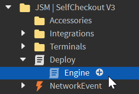

# Updating

:::tip

Not installed SCO v3 yet? Check out our [Installation Guide](/jsm/sco-v3/installation) instead.

:::

When we release updates to SCO v3, you'll be prompted to update your products in-game.

You'll be notified of updates through our [Discord Server](https://discord.whitehill.group) and via on-screen prompts in-game.

### 1. Download the latest version of SCO
Head over to [Axon](https://axon.whitehill.group) and download the latest JSM Self Checkout file. Drag it into Studio as you would any downloaded model.

### 2. Find your current install
In Studio, find your current SCO install in the explorer.

### 3. Delete the outdated Engine
Locate the Engine script in your SCO install. It'll likely be under `Deploy.Engine`.
Select and delete this script.

### 4. Install the new Engine
Locate the Engine script in the new SCO file you downloaded. Drag it from the new install into your existing install, under the Deploy script.

### 5. Delete the new SCO file
After you've moved the Engine script over, you can delete the new Self Checkout install, as it isn't required.