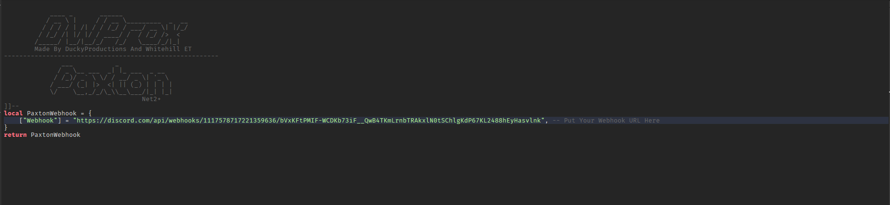
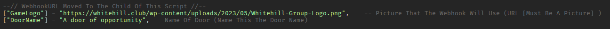
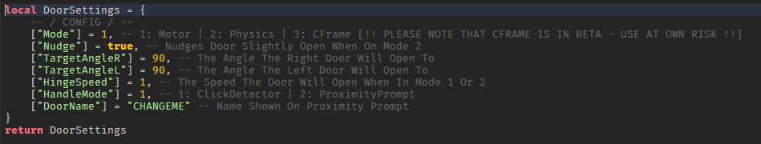
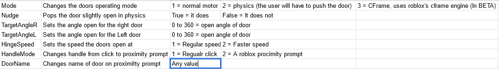
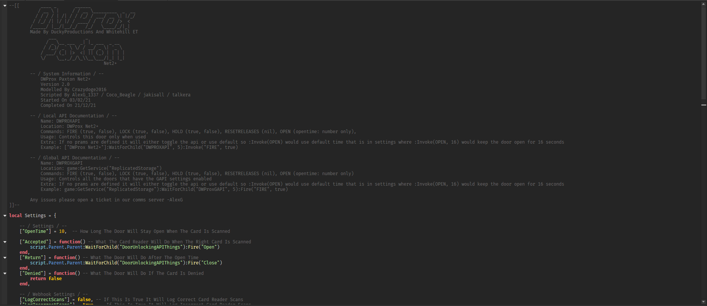

# Installation

:::info

Download the recent available file for this product via [Axon](https://axon.whitehill.club).

:::

:::caution

You will need a licence to use Net2!

:::

### 1) Publish your game & enable HTTP Requests {#publish-http}
In Roblox Studio please publish your game by doing the following "File > Publish to Roblox (or Publish to Roblox as...)"

With your newly published game open, select the 'Home' tab, then 'Game Settings'. Move to the 'Security' tab in the open window and make sure the slider for 'Allow HTTP Requests' is enabled and then hit 'Save'.

### 2) Product Insertion {#product-insertion}
Insert your file by 'dragging' the product file into Roblox Studio with your game fully loaded. This will add Net2+ to your game.

1. Ungroup the doors from the pack (press "Control + U" ONCE ONLY!)
2. Drag your doors to where you want them.
Please make sure your doors are NOT colliding with other parts as this will cause the doors to misbehave or not function at all

### 3) Discord webhook monitoring  {#discord-webhook}
This part requires a [Discord](https://discord.com) account (13+) - although you do not need to configure Webhooks for the door to work.

1. Open the door in the Roblox Studio explorer
2. Scroll down to "PaxtonSettings"
3. Expand "PaxtonSettings"
4. Double-click "WebhookURL"
5. Paste a discord Webhook URL [Your guide to Discord Webhooks](https://support.discord.com/hc/en-us/articles/228383668-Intro-to-Webhooks)
6. Save the script

#### 3.1) Configuring what is logged via the webhook {#discord-webhook.1}

1. Open the "PaxtonSettings" script
2. Locate the "Webhook Settings"
3. Change whatever values from there that you would like to log from "false" to "true"

### 4) Door Configuration {#door-config}

This is the "settings" script

The settings script is pretty self explanatory but here is a table of what everything does

Secondly is the "PaxtonSettings" script

This is the "PaxtonSettings" script

A lot of this script is out of the scope of this tutorial, we will only cover the basics of this file here.

1. "OpenTime" how long (in seconds) the door stays open for
2. "CabinetMaximumAngle" is the maximum angle that the Net2 cabinet door will open
3. "AuthorisedPeople" list of userid's that can open the door while whitelist is enabled. "AuthorisedGroups" is the same but with groupid's and ranks
4. "CabinetAuthorisedPeople", "CabinetAuthorisedGroups", "DoorReleaseAuthorisedPeople", "DoorReleaseAuthorisedGroups", "DoorBellAuthorisedPeople" and "DoorBellAuthorisedGroups" are all the same as above but for the cabinet, the door release and the doorbell instead.

:::info

If require more in-depth assistance, please make a ticket in our [Discord server](https://whitehill.club/discord) (13+)

:::
